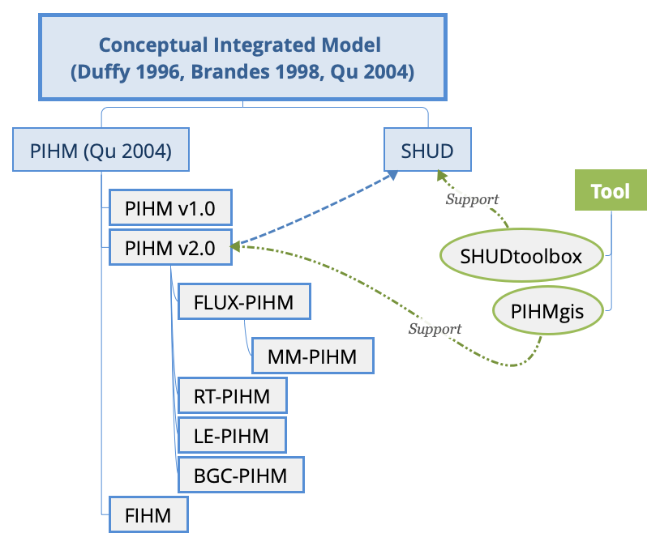
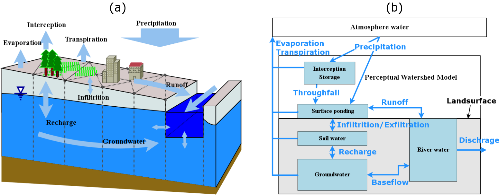
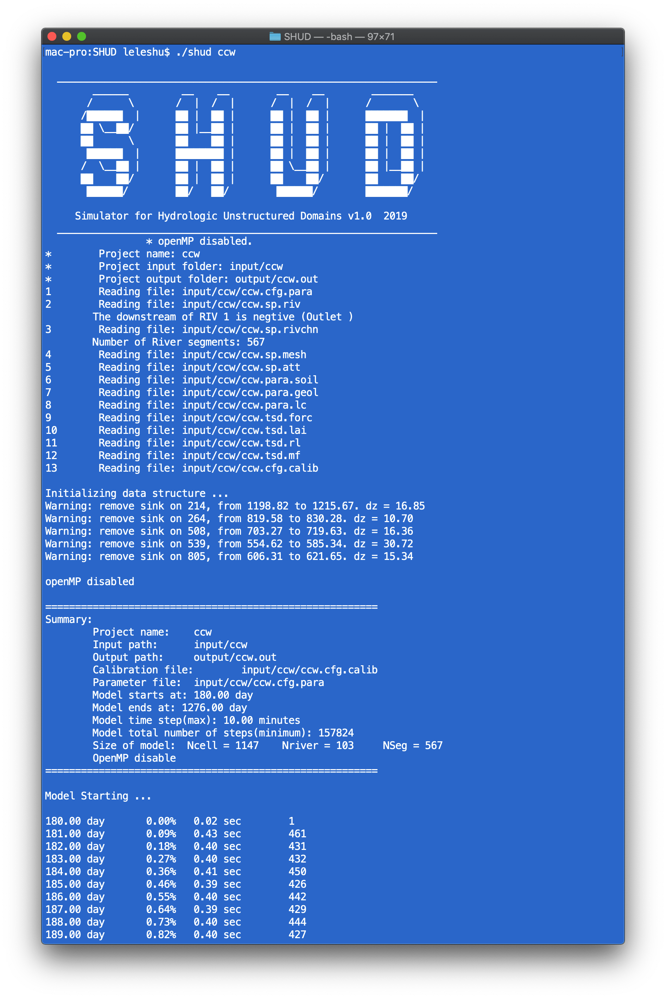

# Simulator for Hydrologic Unstructured Domains

## Brief

The Simulator for Hydrologic Unstructured Domains  (SHUD - pronounced “SHOULD”) is a multi-process, multi-scale hydrological model where major hydrological processes are fully coupled using the semi-discrete **Finite Volume Method** (FVM).

Ongoing applications of the SHUD model include hydrologic analyses of hillslope to regional scales  (1 $ m^2 $ to $10^6$ $\mbox{km}^2$), water resource and stormwater management, and interdisciplinary research for questions in limnology, agriculture, geochemistry, geomorphology, water quality, ecology, climate and land-use change. The strength of SHUD is its flexibility as a scientific and resource evaluation tool where modeling and simulation are required.


- **Maintainner**: Lele Shu ([lele.shu@gmail.com](mailto:lele.shu@gmail.com))
- **Website**: [shud.xyz](shud.xyz)
- **User Guide**: https://www.shud.xyz/_book/
- **Support tools**: SHUD-tools in R.  [https://github.com/SHUD-System/SHUDtoolbox](https://github.com/SHUD-System/SHUDtoolbox)
- **Programming**: C/C++
- **Platform**: Mac OS, Linux and Windows
- **Required library**:  SUNDIALS/CVODE V5.0+
- **Parallelization** : OpenMP

## Overview

The Simulator for Hydrologic Unstructured Domains (SHUD) is a multi-process, multi-scale model where major hydrologic processes are fully coupled using the **Finite Volume Method (FVM)**. SHUD encapsulates the strategy for the synthesis of multi-state distributed hydrologic models using the integral representation of the underlying physical process equations and state variables. As an intellectual descendant of Penn State Integrated Hydrologic Model (**PIHM**), the SHUD model is a continuation of 16 years of PIHM model development in hydrology and related fields since the release of its first PIHM version  (Qu, 2004).




The conceptual structure of the ***two-state integral-balance*** model for soil moisture and groundwater dynamics was originally devised by (Duffy, 1996), in which the partial volumes occupied by unsaturated and saturated moisture storage were integrated directly into a local conservation equation. This two-state integral-balance structure simplified the hydrologic dynamics while preserving the natural spatial and temporal scales contributing to runoff response.

SHUD's design is based on a concise representation of a watershed and river basin's hydrodynamics, which allows for interactions among major physical processes operating simultaneously, but with the flexibility to add or drop state-process-constitutive relations depending on the objectives of the numerical experiment.



### We now summarize the formulation and results from SHUD. 

- SHUD is a physically-based process spatially distributed catchment model. The model applies national geospatial data resources to simulate surface and subsurface flow in gaged or ungaged catchments. SHUD represents the spatial heterogeneity that influences the hydrology of the region based on national soil data and superficial geology. Several other groups have used PIHM, a SHUD ancestor to couple processes from biochemistry, reaction transport, landscape, geomorphology, limnology, and other related research areas.

- SHUD is a fully-coupled hydrologic model, where the conservative hydrologic fluxes are calculated within the same time step. The state variables are the height of ponding water on the land surface, soil moisture, groundwater level, and river stage, while fluxes are infiltration, overland flow, groundwater recharge, lateral groundwater flow, river discharge, and exchange between river and hillslope cells.

- The global ODE system in SHUD is solved with a state-of-the-art parallel ODE solver, known as CVODE \citep{hindmarsh2005sundials} developed at Lawrence Livermore National Laboratory.

- SHUD permits adaptable temporal and spatial resolution. The spatial resolution of the model varies from centimeters to kilometers based on modeling requirements computing resources. The internal time step of the iteration is adjustable and adaptive; it can export the status of a catchment at time-intervals from minutes to days.  The flexible spatial and temporal resolution of the model makes it valuable for coupling with other systems.

- SHUD can estimate either a long-term hydrologic yield or a single-event flood.

- SHUD is an open-source model, available on GitHub \citep{zenodo2019_shud}.

  


## Compliation (Linux or Mac) and run the example watersheds

**Step 1: Install SUNDIALS/CVODE:**

```
./configure
```

This configure is to download teh SUNDIALS from GitHub and install it on your computer.

**Step 2: Compile SHUD with gcc**

```
make clean
make shud

```

If you don't use `gcc`, you may edit the *Makefile* before compiling.

**Step 3: Run the North Fork Cache Creek Watershed example**

```
./shud ccw
```

The screen looks shoud be:


**Step4: Analysis the results of modeling.**

The output files from the SHUD model is save in `./output/ccw.out`.  The R package, SHUDtoolbox, helps to load the input/output files of SHUD. More details about prepare SHUD data, model input/output and visualization is available in SHUD website (https://www.shud.xyz) and help information of SHUDtoolbox.


